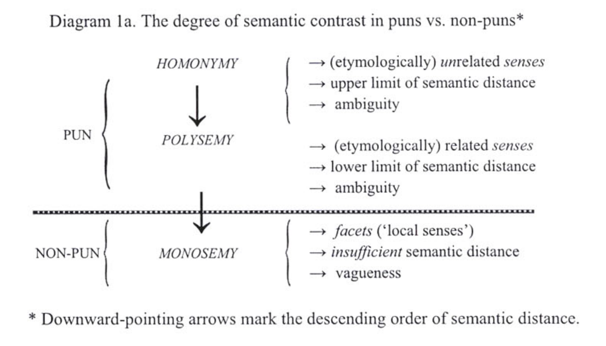
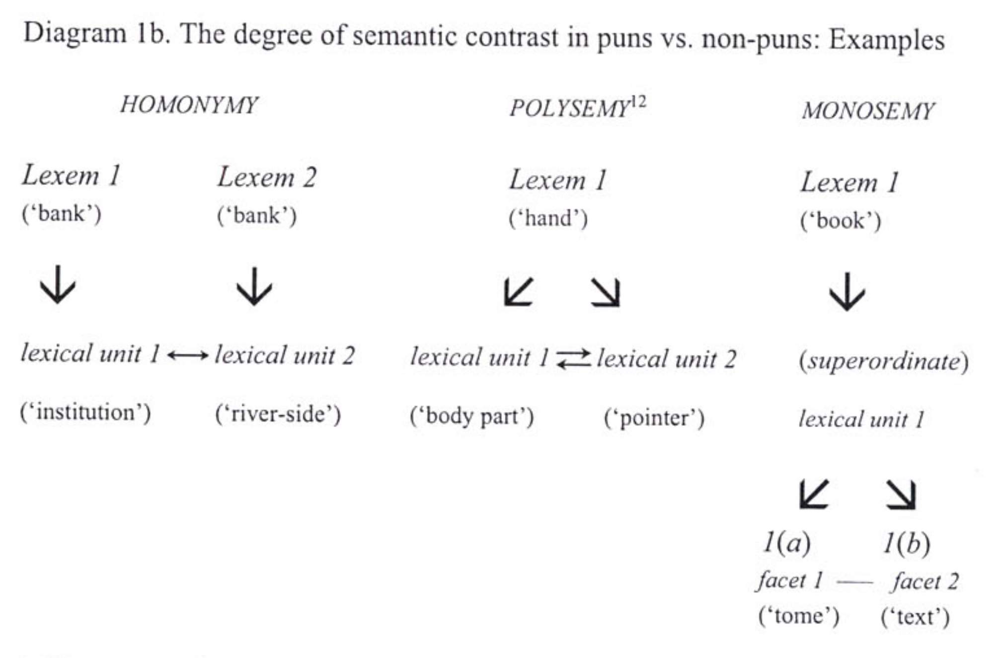

- # nature of puns
	- ## keywords in linguistics
	- **Homography** is when a set of words are spelled identically, but have different meanings. It is not necessary for homographic words to be pronounced the same way, which is called** homophony**.
		- [Lyons, John](http://glottopedia.org/index.php/Lyons,_John). 1968. *Introduction to Theoretical Linguistics.* Cambridge: Cambridge University Press.
	- A **homophone** is a word that is pronounced the same (to a varying extent) as another word but differs in meaning. The two words may be spelled the same, for example rose (flower) and rose (past tense of "rise"), or spelled differently, as in rain, reign, and rein. The term homophone sometimes applies to units longer or shorter than words, for example a phrase, letter, or groups of letters which are pronounced the same as a counterpart. Any unit with this property is said to be homophonous.
	    
	  Homophones that are spelled the same are deemed both homographs and homonyms, e.g. the word read, as in "He is well read" (he is very learned) vs. the sentence "I read that book" (I have finished reading that book).  
	  Homophones that are spelled differently are also called **heterographs**, e.g. to, too, and two.  
	- In linguistics, **homonyms** are words which are either
		- **homographs**—words that have the same spelling (regardless of pronunciation)—or
		- **homophones**—words that have the same pronunciation (regardless of spelling)—or both.
	- **Paronyms** are words that are pronounced or written in a similar way but which have different lexical meanings. Paronyms contrast with homonyms, which are words with different meaning having the same pronunciation or spelling. Examples of English paronyms include:
	    
	  alternately and alternatively  
	  collision and collusion  
	  conjuncture and conjecture  
	  eclipse and ellipse  
	  excise and exercise  
	  prolepsis and proslepsis  
	  continuous and contiguous  
	  affect and effect  
	  upmost and utmost  
	  deprecate and depreciate  
	    
	  The term paronym can also refer to words that are derived from the same root, i.e. cognate words.  
	- A **heteronym** (also known as a heterophone) is a word that has a different pronunciation and meaning from another word but the same spelling. These are homographs that are not homophones. Thus, lead (the metal) and lead (a leash) are heteronyms, but mean (average) and mean (intend) are not, since they are pronounced the same. Heteronym pronunciation may vary in vowel realisation, in stress pattern, or in other ways.
	- ## bookmarks
		- Adamczyk, Magdalena. "The formal composition of puns in Shakespeare's Love's Labour's Lost: a corpus-based study." *Studia Anglica Posnaniensia: International Review of English Studies*, vol. 42, annual 2006, pp. 301+. *Gale Academic OneFile*, link.gale.com/apps/doc/A167977579/AONE?u=nysl_oweb&sid=googleScholar&xid=8103ff3a. Accessed 16 Apr. 2024.
			- Leech's (1974) model of a multi-layered semantic structure, where ultimately also a terminological differentiation is made between the conceptual meaning, labelled "sense", and the remaining types of meaning, subsumed all under a collective name "communicative value", bears some resemblances to Cruse's (1995: 33-49) scrupulous delimitation between genuine meanings, termed likewise "senses", and fake ones, referred to as "facets", (6) and claimed to belong more in the domain of reading/interpretation. (7) Returning to puns, it can be reinstated, this time with the use of Cruse's (1995, 2000) nomenclature, that semantic contrast sufficient to generate a pun is attainable only where fully-fledged senses operate. Unlike facets, which can get simultaneously activated in a single qualifying (non-ambiguous) context, senses are characterized by "mutual antagonism" in that context of this type, where they are admitted individually, always disambiguates them. In other words, whereas facets are capable of generating pure vagueness (i.e. lack of specification) only, where semantic distance does not suffice for a pun to emerge, senses engender genuine ambiguity, the sine qua non of the majority of pun types.
			- {:height 285, :width 438}
			- {:height 320, :width 445}
			- {:height 205, :width 450}
		-
